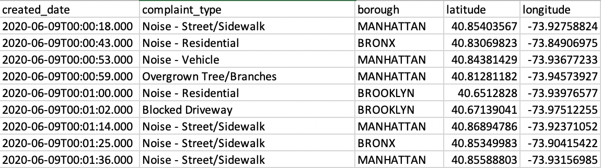
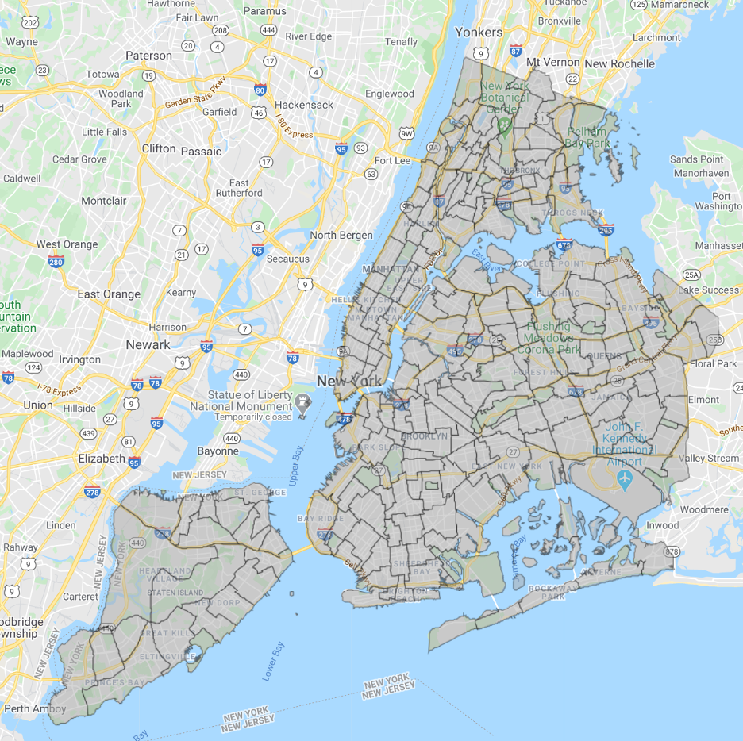
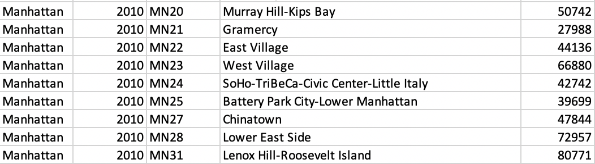
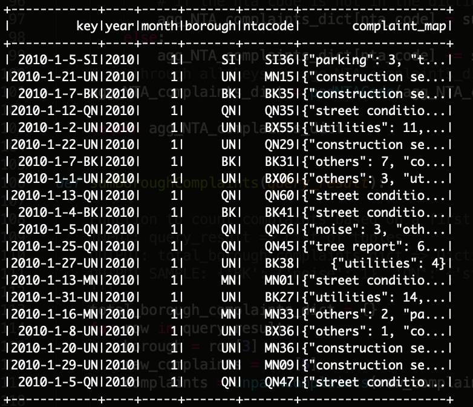

# CityWatch - Creating Smarter Cities Using the 311

## Table of Contents
- [Introduction](#introduction)
- [Data Set](#dataset)
- [Data Pipeline](#datapipeline)
	- [Data Ingestion Layer](#dataingestionlayer)
	- [Data Computation](#datacomputation)
	- [Data Storage](#datastorage)
	- [API Endpoints](#API)
	- [Data Visualization](#datavisualization)
- [Instructions to Run this Pipeline](#instructions)

<a name="introduction"></a>
## Introduction
With increasing urban growth in large metropolitan areas, maintaining city infrastructure becomes a main concern for local municipal governments. Broken and wearing infrastructure costs everyone time and money. Fortunately, these infrastructure or social concerns are reported through 311 calls. In NYC alone, there have been 22 million 311 calls (from 2010 to June 2020), ranging from different complaint types. 

The main objective of this project aims to create a database API and platform that provides aggregated 311 data summaries and trends based on spatial and temporal parameters including the specific 311 complaint type. The potential use case would be to allow local government agencies and urban planners a way to quickly see 311 trends based on a common complaint type for a given neighborhood over a period of time. Hence, these stakeholders can use this information to properly allocate municipal resources in real-time. 

<a name="dataset"></a>
## Data Set
The data used for this project was retrieved from NYC Open Data. Historical 311 calls from 2010 to June 2020 were retrieved as a 13 GB CSV file from the NYC Open Data website. Daily new 311 calls were retrieved using Socrata API and were stored directly into S3. 

A summarized view of the raw 311 data is shown below. 

<p align="center">

</p>

In addition to the 311 Data set, the coordinates for each 311 data call is mapped to a specific neighborhood using NTA geometries. An NTA geometry represents a neighborhood in NYC indicating the neighborhood's code, name, and geometric shape. An example view of NYC split into NTA geometries are shown below. 

<p align="center">

</p>

Population data was also used to determine the number of 311 calls per capita. This was retrieved from census data. Using a forecasted growth rate for each borough, population from 2010 onwards was estimated for 2011-2020.  

<p align="center">

</p>

<a name="datapipeline"></a>
## Data Pipeline
The ETL pipeline used to analyze this data is shown below. AWS EC2 was used to host the entire data pipeline consisting of a Spark Cluster, PostgreSQL database, Flask API instance, and a Front-end instance. 

<p align="center">

</p>

<a name="dataingestionlayer"></a>
### Data Ingestion Layer (S3, EC2, Airflow)
- Historical 311 raw data was first preprocessed to extract the columns of interest and was directly uploaded to S3 where it will be accessed during batch processing. 
- Daily 311 data was retrieved using a daily scheduled workflow through Airflow which retrieves 311 day every midnight and saves the data onto S3. 

<a name="datacomputation"></a>
### Data Computation (Spark, Airflow)
- Spark was used to perform a series of data transformation on both the historical and daily 311 data. These include the following:
	- Cleaning the data
		- Ensuring borough names are consistent (remove human error from data entry)
		- Categorize complaint types based on common complaints (noise-residential, noise-commerical => Noise)
	- Map coordinates of 311 calls into NTA Codes
		- Using geopandas, the coordinates for each 311 call was mapped into an NTA code representing the neighborhood that the 311 call occurred or is referenced to
	- Group and sort based on date, NTA Code, complaint type and perform aggregated count.
		- Aggregated based on date, NTA Code, and then created a complaint map representing a dictionary containing the specific complaint type and its respective count. 
- A sample output of the spark computation is shown in the image below. 

<p align="center">

</p>

<a name="datastorage"></a>
### Data Storage / Schema (PostgreSQL)
- After the Spark computation, PostgreSQL was used to store the resulting count. Aggregating the data resulted in faster write speeds by reducing the number of rows in the database. 
- The schema was designed to use limit CHAR types instead of text/strings where possible. 

311 Table Schema
| Column  	| Type    | 
| --------------|:-------:| 
| key     	| CHAR(18)| 
| year    	| CHAR(4) | 
| month   	| CHAR(2) |
| borough 	| CHAR(2) |
| ntacode 	| CHAR(4) | 
|complaint_map	| TEXT 	  |

Population Table Schema
| Column  	| Type    | 
| --------------|:-------:| 
| ntacode     	| CHAR(4)| 
| population2010| INT 	 | 
| population2011| INT 	 | 
| ...           | INT 	 | 
| population2020| INT 	 | 


<a name="API"></a>
### API Endpoints (Flask, PostgreSQL)
- API endpoints were created using Flask to perform SQL queries on PostgreSQL. 
- The response for each endpoint depends on the specific API call and is returned as a JSON output. 
- Examples of a few API endpoints are the following: 

##### GET /data/complaintType/borough
- Retrieves complaint type distribution for the entire city grouped by borough based on provided year and month
- INPUT parameters: year, month

##### GET /data/complaintType/nta
- Retrieves complaint type distribution for the entire city grouped by NTACode based on provided year and month
- INPUT parameters: year, month

##### GET /data/complaintCount/borough
- Retrieves complaint count for the entire city grouped by borough based on provided year and month
- INPUT parameters: year, month

##### GET /data/complaintCount/nta
- Retrieves complaint count for the entire city grouped by NTACode based on provided year and month
- INPUT parameters: year, month

##### GET /data/complaintCapitaRatio/nta
- Retrieves normalized complaint per capita ratio for the entire city grouped by NTACode
- INPUT parameters: year
- An example output of GET /data/complaintType/nta is shown below:
```
{
      "BX01": {
        "construction services": 1, 
        "miscellaneous concern": 3, 
        "street condition": 2, 
        "unsanitary conditions": 5, 
        "utilities": 4
      }, ...,
      "MN28": {
        "construction services": 4, 
        "miscellaneous concern": 6, 
        "street condition": 1, 
        "unsanitary conditions": 7, 
        "utilities": 9
      }
}
```

<a name="datavisualization"></a>
### Data Visualization (Plotly, Dash)
- To demonstrate the functionality of the API on a sample use case, the 311 calls based on type and count are plotted on a bar and choropleth graph to visualize geospatial and temporal geospatial trends. 

#### Bar Graphs Showing 311 Calls per Borough and Call Type Distribution
<p align="center">

</p>

#### Geospatial 311 Count
<p align="center">

</p>

#### Geospatial 311 Count per Capita
<p align="center">

</p>

<a name="instructions"></a>
## Instructions to Run this Pipeline
- Install python packages: pandas, geopandas, flask, psycopg2-binary
- Prerequisite files: JDBC PostgreSQL JAR - postgresql-42.2.12.jar 
- For Historical 311 Batch Processing, run command after moving files to correct directories:  
```spark-submit --packages com.amazonaws:aws-java-sdk:1.7.4,org.apache.hadoop:hadoop-aws:2.7.7 --master spark://<Master Node DNS> --driver-class-path /home/ubuntu/Project/batch/postgresql-42.2.12.jar --jars /home/ubuntu/Project/batch/postgresql-42.2.12.jar batch_process.py --py-files /home/ubuntu/Project/batch/batch_process_functions.py```
- For Daily 311 Batch Processing using Airflow, run commands after moving files to correct directories: 
	- Initialize the airflow database: ```airflow initdb```
	- Start the webserver on master node: ```airflow webserver -p 8081```
	- Start the scheduler on master node: ```airflow scheduler```
- For Flask, run command after moving files to correct directories: ```python3 api.py```
- For Dash front end, run command after moving files to correct directories: ```python3 app_dash.py```
